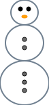
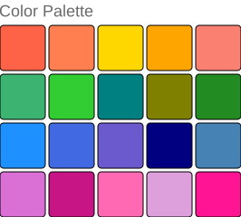
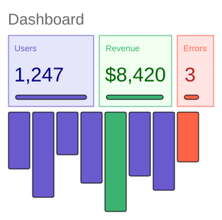
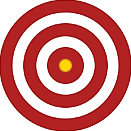

# Steffi Gallery

A showcase of images created with the Steffi DSL. Each example demonstrates different language features — shapes, layouts, colors, and composition.

> **Regenerate all SVGs** by running:
> ```bash
> .\scripts\Regenerate-Gallery.ps1
> ```

---

## Snowman

A classic snowman built with stacked ellipses and circles.



**Source:** [`gallery/snowman.stf`](gallery/snowman.stf)

---

## Color Palette

A grid of named CSS colors arranged with horizontal and vertical stacks.



**Source:** [`gallery/color-palette.stf`](gallery/color-palette.stf)

---

## Abstract Shapes

Overlapping circles, rectangles, and ellipses with semi-transparent fills.


**Source:** [`gallery/abstract-shapes.stf`](gallery/abstract-shapes.stf)

---

## Dashboard

A mock dashboard with stat cards and a bar chart, demonstrating nested layouts and text styling.



**Source:** [`gallery/dashboard.stf`](gallery/dashboard.stf)

---

## Bullseye

Concentric circles forming a classic target, showcasing layered canvas elements.



**Source:** [`gallery/bullseye.stf`](gallery/bullseye.stf)
