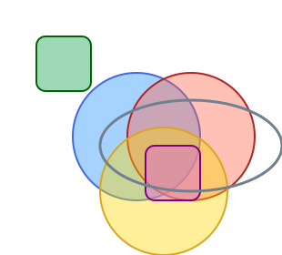

# Steffi

Steffi is a domain-specific language (DSL) for **vector graphics** and **animations** *(coming soon)*. Describe shapes, layouts, and styles in `.stf` files and render them to SVG.

<table>
<tr>
<td>

```scss
Canvas {
  Circle { x: 80; y: 80; r: 70;
    fill: "dodgerblue"; fillOpacity: "0.4";
    stroke: "royalblue"; strokeWidth: 2; }
  Circle { x: 140; y: 80; r: 70;
    fill: "tomato"; fillOpacity: "0.4";
    stroke: "firebrick"; strokeWidth: 2; }
  Circle { x: 110; y: 140; r: 70;
    fill: "gold"; fillOpacity: "0.4";
    stroke: "goldenrod"; strokeWidth: 2; }
  Rectangle { x: 40; y: 40; width: 60; height: 60;
    fill: "mediumseagreen"; fillOpacity: "0.5";
    rx: 10; ry: 10; stroke: "darkgreen"; strokeWidth: 2; }
  Rectangle { x: 160; y: 160; width: 60; height: 60;
    fill: "orchid"; fillOpacity: "0.5";
    rx: 10; ry: 10; stroke: "purple"; strokeWidth: 2; }
  Ellipse { x: 110; y: 110; rx: 100; ry: 50;
    fill: "none"; stroke: "slategray"; strokeWidth: 3; }
}
```

</td>
<td>



</td>
</tr>
</table>

> 🎨 **See more examples in the [Gallery](gallery.md).**

## Highlights

- **Expressive DSL** – Describe vector graphics with a clean, comment-friendly syntax using shapes, layouts, colors, and styles.
- **SVG output** – Render `.stf` files to standards-compliant SVG.
- **Layout engine** – Compose elements with `VerticalStack`, `HorizontalStack`, and `Canvas` containers.
- **Robust parsing pipeline** – Lexer and parser layers are designed for extension, so you can evolve the language safely.
- **Rich console UX** – The CLI uses Spectre.Console to render color-coded panels for documents and structures.
- **Animations** *(coming soon)* – Declarative keyframe animations for shapes and properties.
- **Testable core** – A dedicated unit test suite exercises every parsing rule and regression scenario.

## Development

### Running the CLI
Parse a document and render its structure:
```bash
dotnet run --project .\src\Steffi.Cli\Steffi.Cli.csproj -- structure .\samples\simple.stf
```

For iterative development, keep the command hot-reloading:
```bash
dotnet watch run --project .\src\Steffi.Cli\Steffi.Cli.csproj -- structure .\samples\simple.stf
```

### Running tests
```bash
cd .\src\Steffi.UnitTests\
dotnet watch test
```
